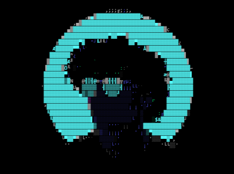

I’m currentlyWorking on **myself and people around me**  :shipit: 

Name : Rupesh Nepal

✉️  **contact.rupesh.nepal@gmail.com**
--- 
<h3 align="center">Languages and Tools:</h3>

  
  
  
  
  
  
  
  
  
  
  
  
  
  
  
  
  
   
  
   
   
  

